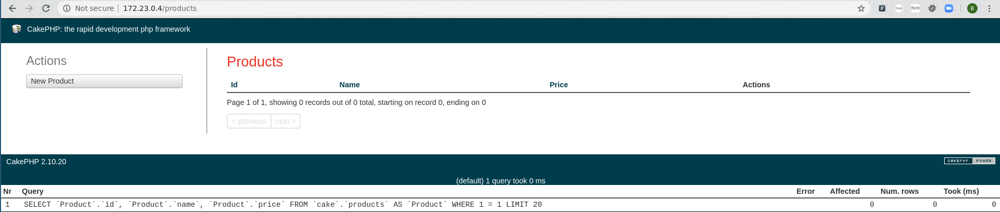
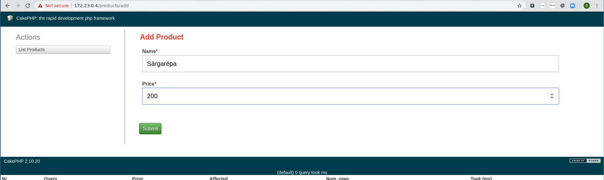

# Cake4g

A simple php project boilerplate for my brother





## Usage

Prerequisites: docker, docker-compose

```docker-compose -f docker-compose.yml up -d```

Figure out the ip using

```docker inspect --format='{{range .NetworkSettings.Networks}}{{.IPAddress}}{{end}}'  cakeweb```


